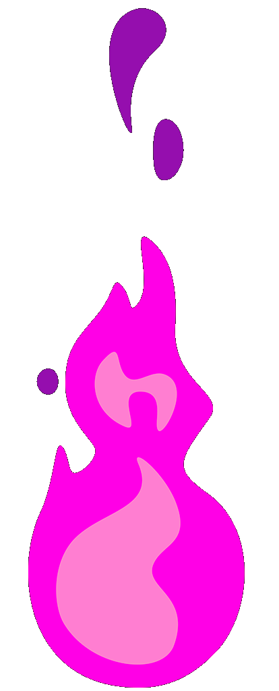

    
  

  
<b>Profile Views</b>

  

<h2></h2>

<h2 align="center"> A passionate Full-Stack Developer and Gameplay Programmer </h2>

<h3>🌱 I’m currently learning <b>C++</b> and <b>Unreal Engine 4 & 5</b></h3>
 

<h3>
  👨‍💻 For more details, check my 
  <a href="https://alishkeir.netlify.app">portfolio</a>
  
</h3>
 

<h3>
  💻 More of my works on
  <a href="https://codepen.io/alishkeir">CodePen</a>
</h3>
 

<h3>
  💬 Ask me about <b>Game</b> and <b>Web</b> Dev
</h3>
 

<h3>
  📫 Reach me at
  <a href="mailto: alishkeir_@hotmail.com">alishkeir_@hotmail.com</a>
</h3>
 

<h3>
  📄 Know about my experiences at
  <a href="https://www.linkedin.com/in/alishkeir/">LinkedIn</a>
</h3>

<h2></h2>

  <h2 style="border-bottom:none!important"> <strong> 📚 Education </strong>  </h2>
   

  
    
  
  
  
  

 

<h2></h2>

   

  
  
  
  <h2 style="border:none"> <strong> ⚙️ Technologies and Skills </strong></h2>
   
  
  
   

  
   
  <h2></h2>

  <h3> <strong>Programming Languages</strong></h3>
    
  <h2></h2>

  <h3> <strong>Game Development</strong></h3>
    
  <h2></h2>

  <h3> <strong>Frontend Development</strong></h3>
    
  <h2></h2>

  <h3> <strong>Backend Development</strong></h3>
    
  <h2></h2>

  <h3> <strong>CMS</strong></h3>
    
  <h2></h2>

  <h3> <strong>Databases</strong></h3>
    
  <h2></h2>

  <h3> <strong>Data Visualization</strong></h3>
    
  <h2></h2>

  <h3> <strong>Devops</strong></h3>
    
  <h2></h2>

  <h3> <strong>Backend as a Service(BaaS)</strong></h3>
    
  <h2></h2>

  <h3> <strong>Testing</strong></h3>
    
  <h2></h2>

  <h3> <strong>Tools</strong></h3>
    
  <h2></h2>

  <h3> <strong>Software</strong></h3>
    
  <h2></h2>

  <h3> <strong>Other</strong></h3>
    

<h2></h2>

<h2 style="border:none"> 🆠My Github Stats </h2> 
    <h2></h2> 
  
  

  

  

 

<h2></h2>

 <h2 align="center"  style="border:none">👨‍💻 Projects </h2> 
  
  
  
  
  
  

 

<h2></h2>

<h2 align="center"  style="border:none">✉️ Contact </h2>
  
  &nbsp
  
  &nbsp
  
  &nbsp
  
  &nbsp
  
</a>

